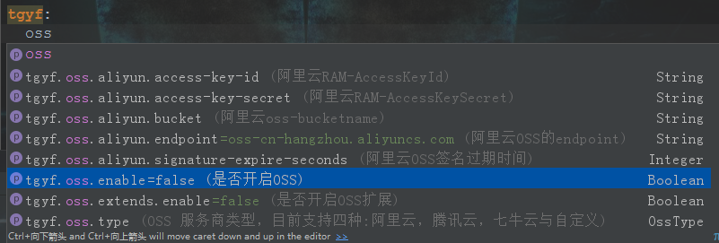

# 对象存储聚合工具
## 项目说明：
* 项目是一个基于SpringBoot的对象存储极速开发聚合工具，项目fork于：
[https://gitee.com/w6513017/HDIS-Framework/tree/master/framework-oss](https://gitee.com/w6513017/HDIS-Framework/tree/master/framework-oss)

* 在fork项目中做了部分修改，将原项目调用模式修改为aop注解方式并聚合了腾讯云与七牛云的对象存储，增加了redis与线程池支持。

```
<?xml version="1.0" encoding="UTF-8"?>
<project xmlns="http://maven.apache.org/POM/4.0.0"
         xmlns:xsi="http://www.w3.org/2001/XMLSchema-instance"
         xsi:schemaLocation="http://maven.apache.org/POM/4.0.0 http://maven.apache.org/xsd/maven-4.0.0.xsd">
    <modelVersion>4.0.0</modelVersion>

    <groupId>com.tgyf.framework</groupId>
    <artifactId>oss</artifactId>
    <version>1.0-SNAPSHOT</version>
    <packaging>jar</packaging>


    <parent>
        <groupId>org.springframework.boot</groupId>
        <artifactId>spring-boot-starter-parent</artifactId>
        <version>2.1.4.RELEASE</version>
        <relativePath/>
    </parent>

    <properties>
        <project.build.sourceEncoding>UTF-8</project.build.sourceEncoding>
        <project.reporting.outputEncoding>UTF-8</project.reporting.outputEncoding>
        <java.version>1.8</java.version>

        <fastjson>1.2.62</fastjson>
        <aliyun-sdk-oss>2.8.3</aliyun-sdk-oss>
    </properties>

    <dependencies>
        <dependency>
            <groupId>org.springframework.boot</groupId>
            <artifactId>spring-boot-configuration-processor</artifactId>
            <optional>true</optional>
        </dependency>

        <dependency>
            <groupId>org.springframework.boot</groupId>
            <artifactId>spring-boot-starter-web</artifactId>
            <scope>provided</scope>
        </dependency>

        <dependency>
            <groupId>org.springframework.boot</groupId>
            <artifactId>spring-boot-starter-aop</artifactId>
        </dependency>

        <!--阿里云Json序列化工具-->
        <dependency>
            <groupId>com.alibaba</groupId>
            <artifactId>fastjson</artifactId>
            <version>${fastjson}</version>
        </dependency>

        <!--阿里云对象存储服务-->
        <dependency>
            <groupId>com.aliyun.oss</groupId>
            <artifactId>aliyun-sdk-oss</artifactId>
            <version>${aliyun-sdk-oss}</version>
        </dependency>

        <!--工具包-->
        <dependency>
            <groupId>org.projectlombok</groupId>
            <artifactId>lombok</artifactId>
            <optional>true</optional>
        </dependency>
    </dependencies>
</project>
```

## 操作说明


```
tgyf:
  oss:
    enable: true
    type: aliyun
    aliyun:
      endpoint: oss-cn-shenzhen.aliyuncs.com
      access-key-id: 
      access-key-secret: 
      bucket: 
      signature-expire-seconds: 
```